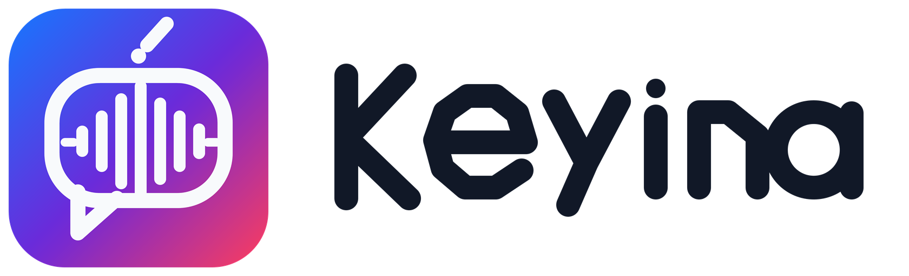

# Keyina



Keyina is a privacy-first Vietnamese input platform for Windows. It is not a visual remake of UniKey or EVKey. The project focuses on measurable behavior:

1. **Reversible composition** — transformations can be undone without losing the original keystrokes.
2. **Context Guard** — deterministic protection for source code, URLs, email addresses, commands, paths, identifiers, and English-heavy tokens.
3. **Native TSF integration** — text edits use Windows Text Services Framework compositions instead of blind global Backspace injection.
4. **Isolated productivity host** — tray, hotkeys, snippets, and optional speech run outside the keystroke DLL.
5. **Evidence-driven releases** — tests, benchmarks, generated-asset hashes, compatibility evidence, and explicit blocked gates replace unsupported claims.

## Architecture

```text
Focused Windows application
        ↕ TSF composition/edit sessions
KeyinaTsf.dll — C++20, native, offline hot path
        ↕ bounded versioned local IPC protocol
Keyina.Host.exe — .NET 10 LTS Windows resident process
  - tray and settings lifecycle
  - familiar input-mode hotkeys
  - deterministic snippets
  - optional Speechmatics Vietnamese dictation
  - Windows Credential Manager integration
```

`KeyinaTsf.dll` does not access the network, microphone, settings UI, clipboard, or Speechmatics. A host/provider failure must not delay normal Vietnamese typing.

## Current verified capabilities

### Native input engine

- Telex letter modifiers and tone keys.
- Modern and traditional tone placement.
- Exact raw-key rollback and Backspace reconstruction.
- 64-key bounded active composition.
- Context transition recovery, such as converting an earlier `á` back to raw `as_` when the token becomes an identifier.
- UTF-32 to validated UTF-16 edit translation.
- Real local `ITfThreadMgr`/`ITfContext`/`ITextStoreACP` integration tests.
- Secure-mode pass-through.

### Host, productivity, and speech foundation

- Deterministic .NET 10 LTS host/core solution with warnings as errors and package lock files.
- Immutable tray/dictation reducers and named-mutex single-instance guard.
- Familiar `Ctrl+Shift` input-mode state machine with left/right modifier, repeat, and shortcut contamination tests.
- Scoped deterministic snippet matcher with secure-input bypass and built-ins such as `;kvi`, `;kvoice`, and `;kdate`.
- Cross-language C#/C++ IPC codec with a shared golden frame, strict UTF-8, 64 KiB frame limit, session ID, and focus generation.
- Optional Speechmatics Realtime protocol/session with 500-chunk backpressure, final ordering, fake-server tests, and offline `--speech-self-test`.
- Windows Credential Manager API-key storage.
- WASAPI microphone adapter, streaming source conversion, and strict 64,000-byte audio buffer.
- Multi-resolution app/tray icons, five vector sources, and 42 generated PNG/ICO assets with SHA-256 verification.

## Verification snapshot

Fresh local verification on 2026-07-29:

- Native Debug: 3/3 tests pass.
- Native Release: 3/3 tests pass.
- Host/.NET: 77/77 tests pass before benchmark-only additions.
- Golden Telex vectors: 100 validated.
- Benchmark comparator: 4/4 tests pass.
- Brand regeneration: byte-identical output and no Git diff.
- Native p99 latency:
  - ASCII pass-through: 0.2 µs
  - letter modifier: 0.4 µs
  - tone update: 0.4 µs
  - protected URL path: 7.5 µs
  - 64-code-point Context Guard: 0.7 µs

- Release speech/host benchmarks:
  - Speechmatics final JSON parse: 13.2 µs p99, 256 B/op
  - transcript partial update: 0.6 µs p99, 256 B/op
  - 30 ms audio conversion: 20.0 µs p99, 2,041 B/op
  - final IPC encode: 0.4 µs p99, 72 B/op
- Release idle host probe: about 21.1 MiB working set, 6.6 MiB private memory, and no measured CPU time over approximately three seconds on the test machine.

See `docs/brand/verification.md` and `docs/compatibility/speechmatics.md` for commands, environment, limits, and blocked gates.

## Repository layout

```text
core/                       Deterministic platform-independent input engine
platform/windows/tsf/       Windows TSF/COM adapter and integration contracts
apps/host/                  .NET host, Windows adapters, speech client, tests, and benchmarks
brand/                      Vector sources and generated Windows assets
benchmarks/                 Native latency benchmarks
tests/                      Native unit, invariant, and TSF integration tests
tools/brand/                Deterministic brand catalog/vector/raster generator
docs/                       Specs, plans, compatibility, brand, and evidence
```

## Build and test

### Native Windows

```powershell
cmake --preset windows-msvc-debug
cmake --build --preset windows-msvc-debug
ctest --preset windows-msvc-debug --output-on-failure

cmake --preset windows-msvc-release
cmake --build --preset windows-msvc-release
ctest --preset windows-msvc-release --output-on-failure
```

### Host and brand

```powershell
dotnet build Keyina.slnx -c Debug
dotnet run --project apps/host/Keyina.Host.Tests/Keyina.Host.Tests.csproj -c Debug --no-build
dotnet build Keyina.slnx -c Release
dotnet run --project apps/host/Keyina.Host/Keyina.Host.csproj -c Release --no-build -- --speech-self-test
dotnet run --project apps/host/Keyina.Host/Keyina.Host.csproj -c Release --no-build -- --resource-self-test
dotnet run --project apps/host/Keyina.Host.Benchmarks/Keyina.Host.Benchmarks.csproj -c Release --no-build
dotnet run --project tools/brand/Keyina.BrandAssets/Keyina.BrandAssets.csproj -c Release --no-build -- generate --root F:\Keyina
git diff --exit-code -- docs/brand brand
```

## Product principles

- Clean-room Apache-2.0 implementation; no source is copied from existing Vietnamese input engines.
- No keystroke logging or cloud telemetry by default.
- Password and secure input scopes are bypassed.
- Speech is optional and isolated from ordinary typing.
- Speech credentials must live in Windows Credential Manager, never config files or the repository.
- Literal input is the fallback for inconsistent native state.
- Production readiness requires signed installation, elevated TSF registration, manual application compatibility, accessibility checks, and a live opt-in Speechmatics smoke test.

## Status

Keyina currently has a verified native engine, focused TSF external edits, current-user IPC routing, deterministic brand assets, familiar Windows hotkeys, tested snippet/IPC cores, and an offline-verified Speechmatics/audio pipeline on .NET 10 LTS. It is **not yet a production-ready installer**. Persistent tray/settings UI, signed installation, elevated TSF registration, live-provider validation, and the third-party compatibility matrix remain active release gates.

Design and execution documents:

- `docs/superpowers/specs/2026-07-29-keyina-vietnamese-text-platform-design.md`
- `docs/superpowers/specs/2026-07-29-keyina-host-speech-brand-design.md`
- `docs/superpowers/plans/2026-07-29-keyina-functional-tsf.md`
- `docs/superpowers/plans/2026-07-29-keyina-brand-host-foundation.md`
