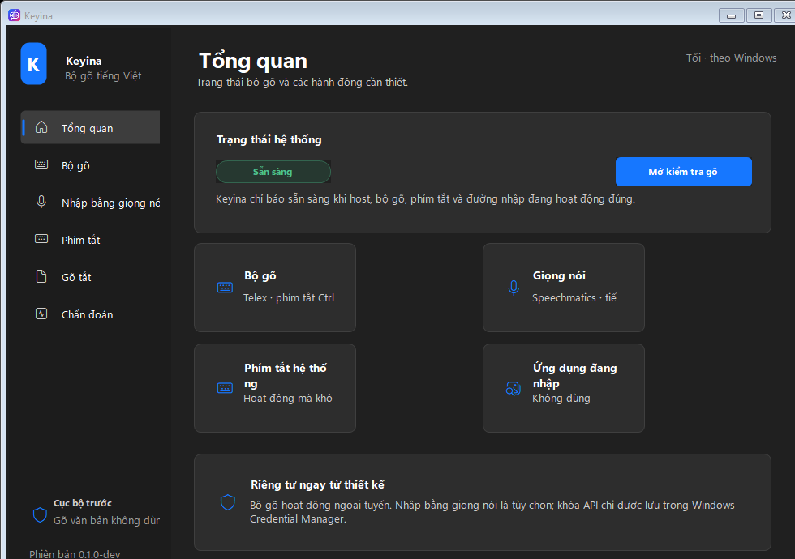
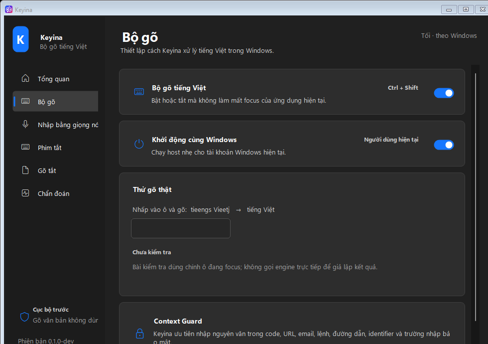
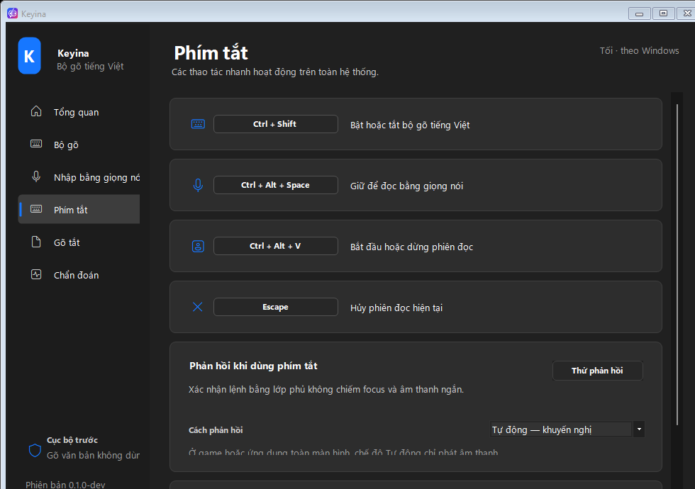
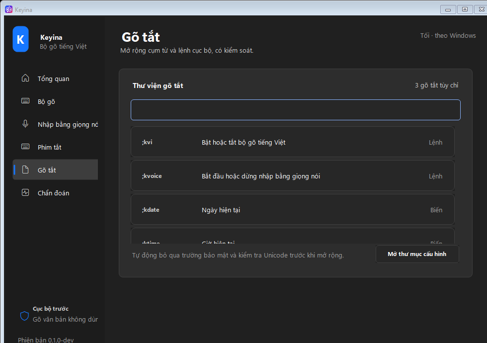
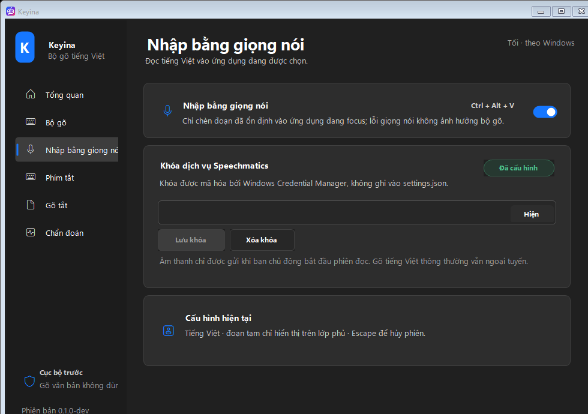
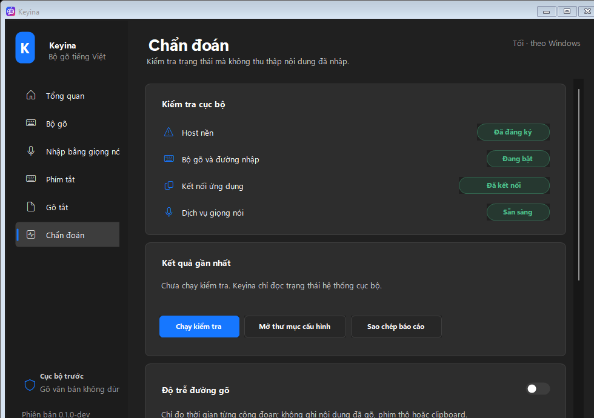

<p align="center">
  
</p>

<p align="center">
  A privacy-first Vietnamese input method for Windows, built around a native C++ engine and a safe resident keyboard hook.
</p>

<p align="center">
  <a href="https://github.com/KanzuXHorizon/Keyina/actions/workflows/ci.yml"></a>
  <a href="LICENSE"></a>
  
  
  
  
</p>

> [!IMPORTANT]
> Keyina is an active **public preview**. The repository includes a reproducible Windows installer and portable-release pipeline, but locally generated artifacts remain unsigned until a trusted code-signing identity is configured. Do not publish unsigned artifacts as a trusted public release, and do not treat the current branch as a stable compatibility promise.

## Why Keyina

Keyina is a clean-room Vietnamese input platform focused on behavior that can be measured and tested rather than recreating another application's interface.

- **No `Win + Space` requirement** — the default path is a resident keyboard hook, similar to familiar Vietnamese input utilities.
- **Reversible composition** — transformations preserve enough state to reconstruct the original physical keystrokes.
- **Context Guard** — deterministic protection for source code, URLs, email addresses, commands, paths, identifiers, and English-heavy tokens.
- **Offline ordinary typing** — the native typing path does not need a network connection, cloud model, clipboard replacement, or telemetry.
- **Fail-open safety** — secure, elevated, unsupported, and uncertain contexts fall back to literal physical input.
- **Optional productivity layer** — tray controls, hotkeys, snippets, diagnostics, opt-in Vietnamese speech input, and focus-safe selection translation remain outside the native engine.

## Interface

<table>
  <tr>
    <td></td>
    <td></td>
  </tr>
  <tr>
    <td></td>
    <td></td>
  </tr>
  <tr>
    <td></td>
    <td></td>
  </tr>
</table>

## Architecture

```text
Physical keyboard events
        ↓ one WH_KEYBOARD_LL, strict fail-open rules
KeyinaInput.exe — C++20 native resident process
  ├─ Vietnamese engine and Context Guard in-process
  ├─ hotkeys, Unicode SendInput, minimal native tray
  ├─ Raw Input mouse registration only during composition
  └─ atomic runtime-input.bin profile reload
        ↓ launch/signal only when requested
Keyina.Host.exe — .NET 10 on-demand companion
  ├─ Settings and onboarding
  ├─ optional Speechmatics dictation
  ├─ optional selection translation and undo
  └─ diagnostics, import/export, credentials

Optional managed fallback
Keyina.Host.exe ↔ KeyinaEngine.dll through the narrow C ABI
```

The native callback processes only supported plain-text events and never performs file, network, UI, or process-launch work. Commands are posted to the resident message loop, while settings changes are reloaded on a low-frequency timer. Injected events carry a private marker and are never reprocessed. Modifier shortcuts, password fields, elevated targets, fullscreen applications, navigation or selection-risk boundaries, and unknown failures reset state and pass literal input through.

The older Windows Text Services Framework implementation remains optional behind `KEYINA_BUILD_TSF=ON`; it is not required for the default typing flow.

## Current capabilities

### Native Vietnamese engine

- Telex letter modifiers and tone keys.
- Modern and traditional tone placement.
- Vietnamese syllable validation with flexible recovery for practical typing.
- Exact raw-key rollback and Backspace reconstruction.
- Bounded active composition and UTF-32 to validated UTF-16 translation.
- Context transitions that recover literal identifiers, paths, URLs, and mixed-language tokens.
- Native unit, invariant, integration, golden-vector, and latency tests.

### Windows runtime and companion

- Native C++ resident with one keyboard hook, zero-allocation ordinary typing, a minimal tray, and no low-level mouse hook.
- Familiar, fully configurable global shortcuts with transactional conflict rollback; command work is posted off the hook callback.
- Settings and onboarding run in an on-demand .NET 10 WinForms companion with Fluent-inspired light, dark, and high-contrast UI.
- Settings publish a checksummed 36-byte runtime profile atomically; the native resident reloads it without restarting.
- Deterministic native snippets match raw triggers before Telex and activate on an explicit delimiter such as Space. Each snippet can keep or consume that delimiter; `${date}`, `${time}`, and `${datetime}` expand locally at activation time.
- Secure-input snippet bypass, onboarding, credential-free settings import/export, and per-application exclusions for typing, speech, translation, and visual feedback.
- Optional Speechmatics Vietnamese dictation uses focus-locked direct Unicode delivery and Windows Credential Manager storage.
- Provider-neutral selection translation uses DeepL with an optional user-configured LibreTranslate fallback, preview, one-shot undo, exact protection for code/URLs/placeholders, focus guarding, bounded requests, and separate Credential Manager storage.
- Deterministic generated icons, lockups, screenshot gallery, resource gates, live typing self-tests, portable ZIP, and a per-user Windows installer pipeline.

## Privacy and security model

Ordinary Vietnamese typing stays local. `KeyinaEngine.dll` has no responsibility for network access, microphone capture, cloud credentials, telemetry, settings UI, or clipboard replacement.

Speech input is explicitly optional and isolated in the host. Its API credential must be stored in Windows Credential Manager and must never be committed to the repository or written to normal configuration files.

Selection translation is also opt-in. It sends only the text explicitly selected by the user to the configured DeepL endpoint, restores the previous clipboard contents, never logs source or translated text, and refuses to insert after focus changes. DeepL API Free must not be used for personal, confidential, or sensitive content. Setup and limits are documented in [docs/translation.md](docs/translation.md).

See [SECURITY.md](SECURITY.md) for private vulnerability reporting and [docs/compatibility/typing.md](docs/compatibility/typing.md) for compatibility boundaries.

## Build from source

### Requirements

- Windows 10 version 2004 or newer, or Windows 11, x64.
- Visual Studio 2022 with **Desktop development with C++**.
- CMake 3.25 or newer.
- The .NET SDK selected by [`global.json`](global.json).
- Python 3 for validation scripts.

### Clone and configure

```powershell
git clone https://github.com/KanzuXHorizon/Keyina.git
cd Keyina
cmake --preset windows-msvc-debug
```

### Build and test

```powershell
cmake --build --preset windows-msvc-debug
ctest --preset windows-msvc-debug --output-on-failure

dotnet build Keyina.slnx -c Debug
dotnet run --project apps/host/Keyina.Host.Tests/Keyina.Host.Tests.csproj -c Debug --no-build
```

### Publish and run the Windows bundle

```powershell
powershell -ExecutionPolicy Bypass -File scripts/windows/publish.ps1
.\artifacts\publish\win-x64\KeyinaInput.exe
```

`KeyinaInput.exe`, `Keyina.Host.exe`, `KeyinaEngine.dll`, and the native tray icons are published beside one another. Open Settings from the tray; the managed companion exits after its final window closes. The development binaries are unsigned. Windows or security software may warn about locally built keyboard-hook software. Review the source and build it yourself; do not bypass organizational security policy.

### Build an installer and portable release

```powershell
powershell -NoProfile -ExecutionPolicy Bypass `
  -File scripts/windows/build-release.ps1

powershell -NoProfile -ExecutionPolicy Bypass `
  -File scripts/windows/verify-release.ps1 `
  -Version 0.1.0
```

Artifacts are written under `artifacts/release/<version>/`. Signing is fail-closed when `-Sign -RequireSignature` is used. Certificate-store and PFX configuration, silent installation, upgrade behavior, checksums, and versioning are documented in [`docs/releasing.md`](docs/releasing.md).

## Verification lanes

### Native Debug and Release

```powershell
cmake --preset windows-msvc-debug
cmake --build --preset windows-msvc-debug
ctest --preset windows-msvc-debug --output-on-failure

cmake --preset windows-msvc-release
cmake --build --preset windows-msvc-release
ctest --preset windows-msvc-release --output-on-failure

python tools/check_vectors.py
python tools/test_compare_benchmark.py
```

### Host, speech, resources, and benchmarks

```powershell
dotnet build Keyina.slnx -c Debug
dotnet run --project apps/host/Keyina.Host.Tests/Keyina.Host.Tests.csproj -c Debug --no-build
dotnet run --project apps/host/Keyina.Host/Keyina.Host.csproj -c Debug --no-build -- --self-test
dotnet run --project apps/host/Keyina.Host/Keyina.Host.csproj -c Debug --no-build -- --speech-self-test
dotnet run --project apps/host/Keyina.Host/Keyina.Host.csproj -c Debug --no-build -- --hotkey-self-test

dotnet build Keyina.slnx -c Release
dotnet run --project apps/host/Keyina.Host/Keyina.Host.csproj -c Release --no-build -- --resource-self-test
dotnet run --project apps/host/Keyina.Host.Benchmarks/Keyina.Host.Benchmarks.csproj -c Release --no-build

.\build\windows-msvc-release\platform\windows\input\Release\KeyinaInput.exe --self-test
.\build\windows-msvc-release\platform\windows\input\Release\KeyinaInput.exe --typing-self-test
.\build\windows-msvc-release\platform\windows\input\Release\KeyinaInput.exe --resource-self-test
.\build\windows-msvc-release\platform\windows\input\Release\KeyinaInput.exe --tray-resource-self-test
.\build\windows-msvc-release\platform\windows\input\Release\KeyinaInput.exe --profile-reload-self-test
```

### Deterministic brand assets

```powershell
dotnet run --project tools/brand/Keyina.BrandAssets/Keyina.BrandAssets.csproj -c Release --no-build -- generate --root $PWD
git diff --exit-code -- docs/brand brand
```

Performance results are hardware-specific. Reproducible commands, comparison thresholds, and evidence live in [`docs/benchmarks/`](docs/benchmarks/) and [`docs/brand/`](docs/brand/).

## Repository map

```text
core/                       Platform-independent C++ input engine
platform/windows/hook/      Native C ABI bridge for the default hook backend
platform/windows/tsf/       Optional legacy TSF/COM backend
apps/host/                  .NET host, Windows adapters, speech, UI, tests, benchmarks
brand/                      Vector sources and deterministic generated assets
benchmarks/                 Native latency benchmarks
tests/                      Native unit, invariant, and Windows integration tests
tools/                      Brand and verification utilities
docs/                       Architecture, compatibility, evidence, specs, and plans
```

## Release gates

The project is public before it is production-ready. A stable release still requires:

- A trusted public code-signing identity and signed public artifacts; the reproducible installer, portable ZIP, checksums, manifest, and signing hooks are implemented.
- Wider manual compatibility coverage across browsers, editors, terminals, Office applications, accessibility tools, Remote Desktop, and elevated applications.
- Clean-VM install, upgrade, uninstall, SmartScreen, and accessibility verification for every public release candidate.
- Live opt-in speech-provider validation without exposing credentials.
- A hosted update-discovery mechanism; current updates use versioned installers with a stable AppId and documented in-place upgrade path.

Open work is tracked through GitHub issues and the design/implementation documents under [`docs/superpowers/`](docs/superpowers/).

## Contributing

Read [CONTRIBUTING.md](CONTRIBUTING.md) before opening a pull request. The project accepts focused, tested contributions that preserve privacy, literal fallback, deterministic behavior, and clean-room licensing boundaries.

- Bug reports and feature requests use the structured GitHub issue forms.
- Security vulnerabilities use the private process in [SECURITY.md](SECURITY.md).
- Community behavior follows [CODE_OF_CONDUCT.md](CODE_OF_CONDUCT.md).
- General support scope is documented in [SUPPORT.md](SUPPORT.md).

## Clean-room notice

Keyina is not affiliated with UniKey, EVKey, OpenKey, Microsoft, or Speechmatics. No source code from existing Vietnamese input engines is copied into this repository. Product and company names are used only to explain compatibility or user expectations.

## License

Copyright 2026 Keyina contributors.

Licensed under the [Apache License 2.0](LICENSE).
